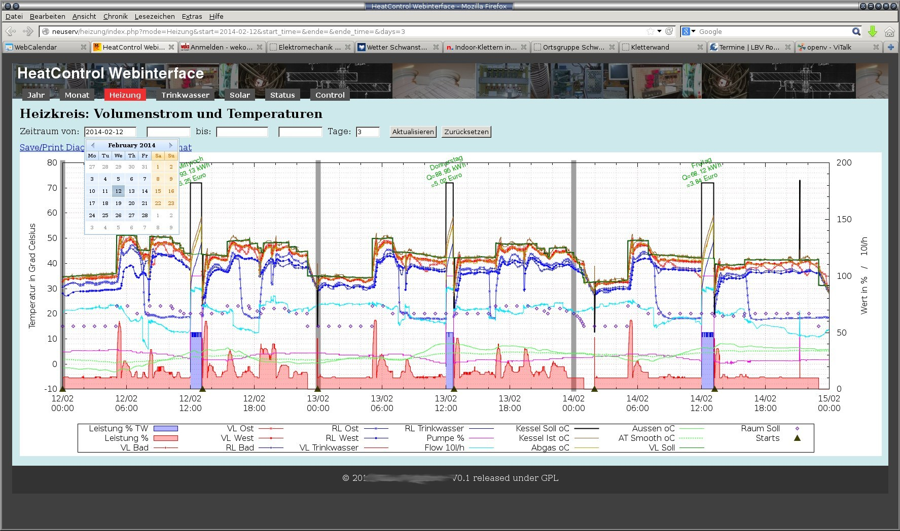

Vor einiger Zeit habe ich auch eine Software für das 300er Protokoll geschrieben. Vcontrold konnte da nur KW und vconnect entsprach auch nicht so ganz meinen Vorstellungen.

Es hat keine XML Konfiguration. Stattdessen gibt es für jeden Parameter eine kleine C-Funktion in der ggf. entsprechende Anpassungen gemacht werden.
Ich benutze es für die Vitodens B3HA und dafür sind in dem Archiv auch die Parameter konfiguriert.

Die Funktionen werden in einer Tabelle verwaltet. Nach dem Start gibt es einen Telnet-Port über den die Bedienung möglich ist.
Die Parameter werden beim Lesezugriff gecached, so dass relativ schnelle Zugriffe auch von verschiedenen Prozessen aus möglich sind.

So sieht das dann aus. Mann kann einen kleinen Hilfetext abfragen:
```

klaus@hektor:~$ nc heizung 83
Welcome at vitalk, the Vitodens telnet Interface. (6)
h
Short Help Text:
  h, help                 - This Help Text
  frame_debug <on/off>    - Set state of Frame Debugging
  list [class]            - Show parameter List
  g, get <p_name>         - Query Parameter
  gvu <p_name>            - Get Value of Parameter with Unit
  s, set <p_name> <value> - Set Parameter
  gc <class>              - Query a class of Parameters
     Parameterklassen:
       P_ALLE       0
       P_ERRORS     1
       P_ALLGEMEIN  2
       P_KESSEL     3
       P_WARMWASSER 4
       P_HEIZKREIS  5
       P_BRENNER    6
       P_HYDRAULIK  7


```


Die Parameter kann man alle, in Klassen oder einzeln abfragen. Funktionen zum Schreiben der Parameter sind nur teilweise implementiert, soweit ich das gebraucht habe.

```

gc
02:             deviceid: 0x20cb
02:                 mode: 2
02:            mode_text: Heizen und Warmwasser
02:         outdoor_temp: 12.20 oC
02:      outdoor_temp_tp: 12.00 oC
02:  outdoor_temp_smooth: 10.70 oC
03:           k_ist_temp: 39.00 oC
03:        k_ist_temp_tp: 39.00 oC
03:          k_soll_temp: 35.70 oC
03:         k_abgas_temp: 37.60 oC
04:         ww_soll_temp: 45 oC
04:          ww_ist_temp: 42.80 oC
04:       ww_ist_temp_tp: 42.80 oC
04:            ww_offset: 20 K
05:         vl_soll_temp: 35.70 oC
05:       raum_soll_temp: 20 oC
05:   red_raum_soll_temp: 10 oC
05:               niveau: 4 K
05:              neigung: 1.0
06:               starts: 312
06:            runtime_h: 0321.4 h
06:              runtime: 1156876 s
06:                power: 10.0 %
07:               ventil: 1
07:          ventil_text: Heizkreis
07:           pump_power: 21 %
07:                 flow: 628 l/h


```

Einzelne Abfragen kann man mit Einheit oder ohne ausgeben lassen und halt noch bischen so schnickschnack:

```

g flow
628
gvu flow
627 l/h
set ww_soll_temp 45
OK


```


Bei mir läuft das übrigens auf einem RaspberryPi. Wobei ich mir inzwischen vielleicht lieber mal dieses Beaglebone Teil ansehen würde.



